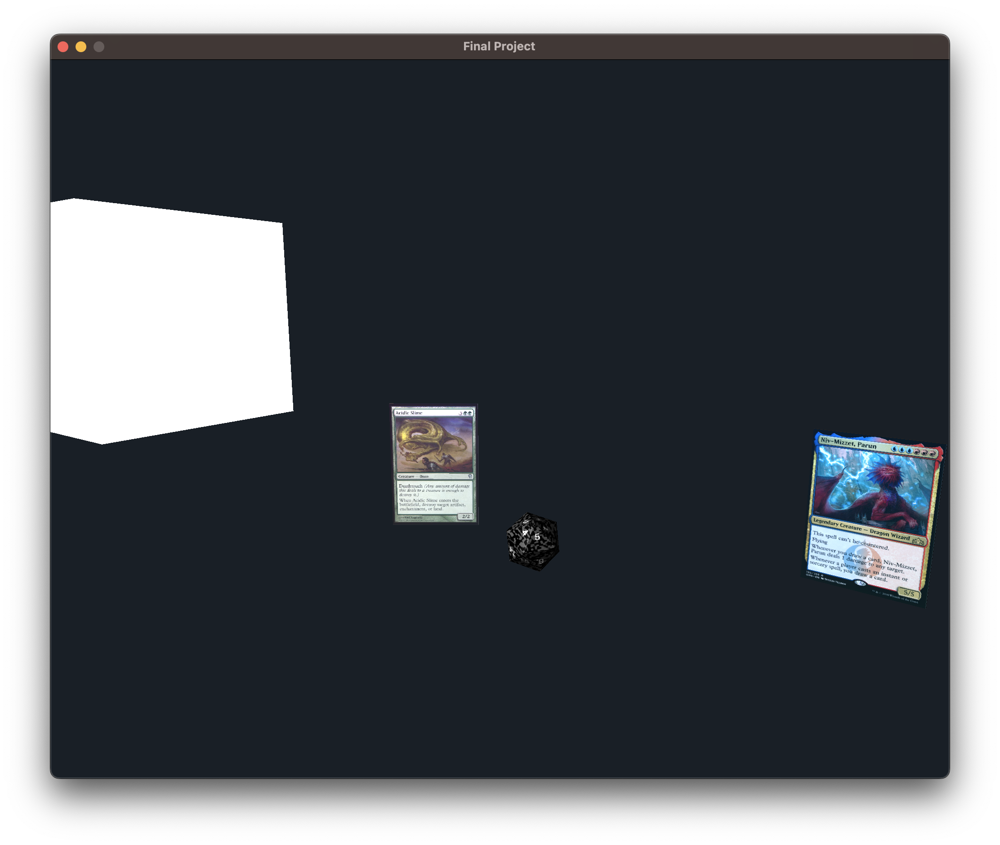

# Haskell GL Example

## Build Requirements
- GHC 9.2.5 
- cabal 3.6.2.0

## Build Commands
- `cabal build` (this might take a minute)
- `cabal run`

## Result

## Controls
- `awsd` for left, forward, back, right
- mouse for pitch and yaw 